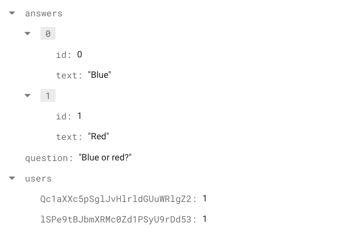

# Step 5: Vote Action

## 💡 Explanation
Each poll has a list of users. Once a user votes on a poll, their `uid` along with the `answerId` is stored in the poll document.
In the following image, we see one poll document. You can note that 2 users has chosen the color Red.

### On this step:
1. We will implement the `vote()` method.

## 🥲 Stuck?
Just click on **Show Solution** button somewhere below 👇🏻.